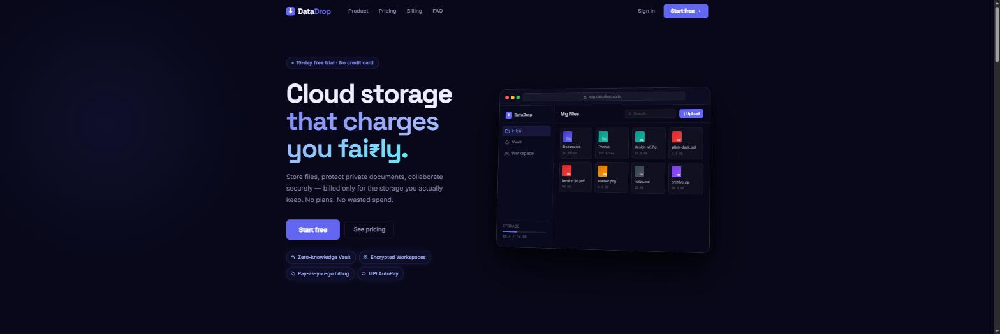
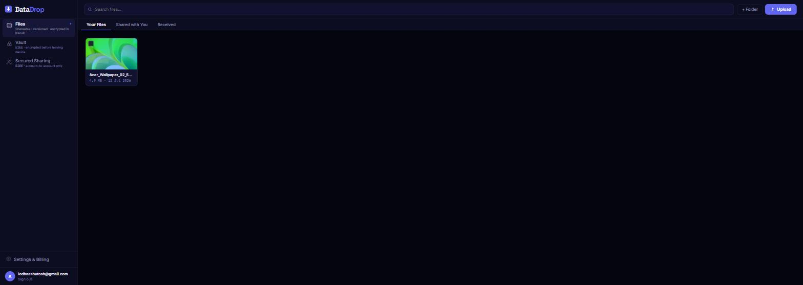
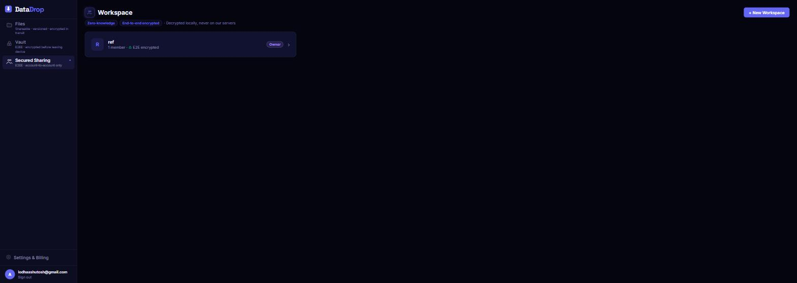
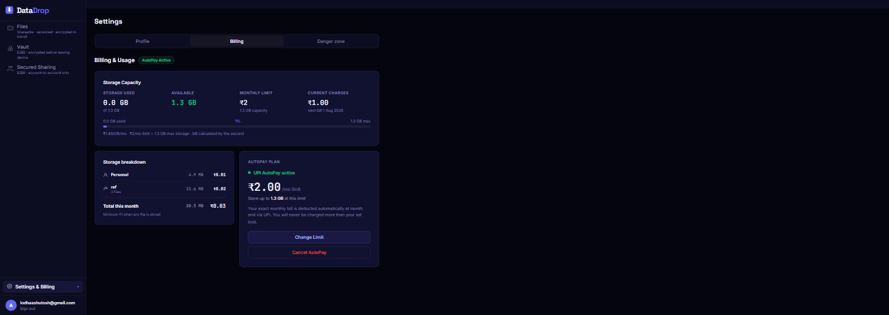

# DataDrop

**Cloud storage that charges you fairly.**

DataDrop is a privacy-first cloud storage service built entirely on Cloudflare's edge network. Files are stored on Backblaze B2, billing is pay-as-you-go via Razorpay (UPI AutoPay), and sensitive files can be locked in a zero-knowledge, end-to-end encrypted Vault that the server can never read.

[](https://datadrop.co.in) [](https://workers.cloudflare.com/) [](https://react.dev)



## Why DataDrop

Most cloud storage sells you a fixed plan sized for your worst month. DataDrop bills per GB actually stored, deducted automatically at month-end via UPI AutoPay — no tiers, no "upgrade to Pro" walls.

- **Pay only for what you store** — ₹/GB/month, billed by the second, with a spending cap you control
- **Zero-knowledge Vault** — files are encrypted client-side before they ever leave your device; DataDrop's servers never see the plaintext or the keys
- **Encrypted team workspaces** — share files account-to-account with the same end-to-end guarantees as the personal Vault
- **Built entirely on the edge** — no origin servers, no regions to pick; every request is handled by the nearest Cloudflare PoP

## Features

### Files
- Drag-and-drop upload with folders, versioning, and CDN-backed delivery
- Chunked/multipart uploads for large files (B2 large-file API)
- Share links with expiry and access controls
- Inline video streaming with signed URLs



### Vault (zero-knowledge, end-to-end encrypted)
- **V2 (current):** ECDH P-256 key pair per user; every file gets its own AES-256-GCM data key, wrapped with your public key and stored server-side — DataDrop can store the wrapped key but never unwrap it without your PIN
- **V1 (legacy):** PIN → PBKDF2 → AES-256 vault key, encrypted client-side before upload
- "Forgot PIN" recovery flow, fully separate from the account password


### Secured Sharing (Teams)
- Account-to-account encrypted workspaces for collaborating on sensitive files
- Per-team key wrapping (`team_keys`) — decrypted locally, never on DataDrop's servers
- Member roles, invites, and per-workspace billing



### Billing
- Real-time storage usage and cost breakdown by workspace
- UPI AutoPay — set a monthly spend limit, get billed automatically, never charged more than your cap
- Storage reconciled hourly; bill preview generated before month-end; final charge deducted on the 1st



## Architecture

DataDrop runs as a set of Cloudflare Workers behind a shared D1 database, KV cache, and Queue — no traditional backend servers.

```
                                   ┌─────────────────────┐
                                   │   Cloudflare Pages   │
                                   │  app.datadrop.co.in  │
                                   │   (React + Vite)     │
                                   └──────────┬───────────┘
                                              │
              ┌───────────────────────────────┼───────────────────────────────┐
              │                               │                               │
   api.datadrop.co.in              files.datadrop.co.in            stream.datadrop.co.in
   /user /files /vault                  (CDN delivery)                (video streaming)
   /teams /shares                               │                               │
              │                               │                               │
              └───────────────┬───────────────┴───────────────┬───────────────┘
                              │                               │
                     ┌────────▼────────┐             ┌────────▼────────┐
                     │  datadrop-api    │             │ datadrop-upload  │
                     │  (main Worker)   │             │ (chunked B2      │
                     │                  │             │  upload proxy)   │
                     └───┬─────┬────┬───┘             └────────┬─────────┘
                         │     │    │                          │
              ┌──────────┘     │    └──────────┐               │
              │                │               │               │
        ┌─────▼─────┐   ┌──────▼─────┐  ┌──────▼──────┐        │
        │ D1 (SQL)  │   │  KV (cache) │  │ Queue        │       │
        │ datadrop- │   │  sessions   │  │ migrations   │       │
        │   db      │   │             │  │ (async)      │       │
        └───────────┘   └─────────────┘  └──────────────┘       │
                                                                  │
                              ┌───────────────────────────────────┘
                              │
                     ┌────────▼────────┐
                     │  Backblaze B2    │
                     │  datadrop-cold   │  ← regular files
                     │  datadrop-vault  │  ← E2EE vault objects
                     └──────────────────┘
```

Cron-triggered Workers handle billing, backups, trial expiry, and hourly storage reconciliation. A queue consumer processes async file migrations (files ↔ vault ↔ team) off the request path to stay under Worker CPU limits.

## Tech stack

| Layer | Technology |
|---|---|
| Compute | Cloudflare Workers (`nodejs_compat`) |
| Database | Cloudflare D1 (SQLite at the edge) |
| Cache / sessions | Cloudflare KV |
| Async jobs | Cloudflare Queues |
| Object storage | Backblaze B2 (cold + vault buckets) |
| Backup | Cloudflare R2 |
| Auth | Clerk (session), Firebase Auth (phone OTP) |
| Payments | Razorpay (wallet + UPI AutoPay mandates) |
| Email | Resend |
| SMS/OTP | MSG91 |
| Frontend | React 18, Vite, React Router |
| Frontend hosting | Cloudflare Pages |
| Encryption | Web Crypto API — ECDH P-256, AES-256-GCM, PBKDF2 |

## Repository layout

```
datadrop-storage/
├── wrangler.toml              # Main worker config (datadrop-api)
├── schema/
│   ├── schema.sql             # Canonical D1 schema (fresh installs only)
│   └── migration_v*.sql       # Incremental migrations
├── workers/
│   ├── api-router/            # Main router + route handlers → bundled into datadrop-api
│   │   ├── files.js           # File CRUD, folders, sharing, versions
│   │   ├── shares.js          # Share link management
│   │   ├── user.js            # Profile, wallet top-up, OTP, billing meter
│   │   ├── vault.js           # E2EE vault (v1 PIN+AES, v2 ECDH P-256 + per-file DEK)
│   │   └── teams.js           # E2EE account-to-account team workspaces
│   ├── upload/                # datadrop-upload — B2 chunked/multipart upload proxy
│   ├── download/               files.datadrop.co.in — CDN download handler
│   ├── stream/                 stream.datadrop.co.in — video streaming
│   ├── admin/                  admin.datadrop.co.in — internal admin panel
│   ├── billing/                Cron: Razorpay billing (1st of month)
│   ├── backup/                 Cron: daily R2 → B2 backup
│   ├── trial/                  Cron: trial expiry enforcement
│   ├── reconcile/               Cron: hourly storage byte reconciliation
│   ├── migration/               Queue consumer: async file migrations
│   ├── report/                  User-initiated file reports
│   ├── webhook/                 Clerk + Razorpay webhook handlers
│   └── shared/utils.js          Shared auth, CORS, D1 helpers, B2 API, email
└── app/                        # React + Vite frontend (Cloudflare Pages: datadrop-app)
    └── src/
        ├── pages/Dashboard.jsx        # Main app shell — views, upload, file management
        ├── components/FileGrid.jsx    # Shared file/folder grid
        ├── components/VaultSetup.jsx  # Vault unlock + E2EE client-side crypto
        ├── components/TeamsView.jsx   # Team workspace UI
        └── lib/api.js                 # Typed API client
```

## Getting started (self-hosting)

DataDrop is built for Cloudflare's platform, so running your own instance means provisioning the same primitives under your own account.

**Prerequisites:** a Cloudflare account, a Backblaze B2 account, and accounts with Clerk, Razorpay, Resend, and MSG91 (or equivalents you adapt the code for).

```bash
# Install dependencies
npm install
cd app && npm install && cd ..

# Create the D1 database, KV namespace, and R2 bucket, then update the
# resulting IDs in wrangler.toml and workers/upload/wrangler.toml

# Apply the schema to a fresh D1 database (only ever run once, on a new DB)
npx wrangler d1 execute datadrop-db --remote --file=schema/schema.sql

# Set secrets (see wrangler.toml for the full list)
npx wrangler secret put CLERK_SECRET_KEY
npx wrangler secret put B2_COLD_KEY_ID
# ...repeat for each secret listed in wrangler.toml

# Deploy the main API worker
npx wrangler deploy

# Deploy the upload worker
npx wrangler deploy --config workers/upload/wrangler.toml

# Build and deploy the frontend
cd app && npm run build
npx wrangler pages deploy dist --project-name datadrop-app
```

Local frontend development proxies API calls to the live backend:

```bash
cd app && npm run dev   # http://localhost:3000, proxies /api/* → api.datadrop.co.in
```

Run the worker test suite:

```bash
npm test
```

## Security notes

- No secrets are committed to this repository — everything is provisioned via `wrangler secret put` at deploy time
- Vault and Team data use client-side encryption (Web Crypto: ECDH P-256, AES-256-GCM); DataDrop's servers store only ciphertext and wrapped keys
- Session tokens are validated against Clerk on each request and cached in KV with a short TTL

## License

No license has been chosen yet — all rights reserved by default. Open an issue if you'd like to discuss licensing.
